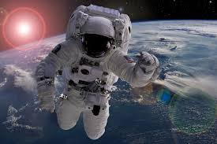

# Project 2 - Astronauts Background and Career
 

## Inspiration & Rationale 
NASA, SpaceX was launched on May 30th, 2020
This is the first orbital Commercial Crew SpaceX Demonstration Mission 2 (CREWED) launch to depart to a Space Station from U.S. since 2011

This historic mission was launched from U.S. soil for the first time since the conclusion of the Space Shuttle Program in 2011

The SpaceX Crew Dragon spacecraft carrying NASA astronauts Robert Behnken and Douglas Hurley lifted off at 3:22 p.m. EDT Saturday on the company’s Falcon 9 rocket from Launch Complex 39A at NASA’s Kennedy Space Center in Florida

## Our Project Topic
The recent launch inspired us to focus on Astronauts overall career path, origin, gender, major, space missions, flights, and moon walks

### Data Sources
* https://www.kaggle.com/nasa/astronaut-yearbook/data#

### AWS Deployment Link
* http://astronautsmap-env.eba-vi3mznpp.us-east-2.elasticbeanstalk.com/

## Go through our website and check our interactive plots, filter table and our real-time map showing the current position of the ISS!!

#### Project collaborators: Antonia Adeleke, Cassandra Carrizal, Thai Nguyen & Maria Soto